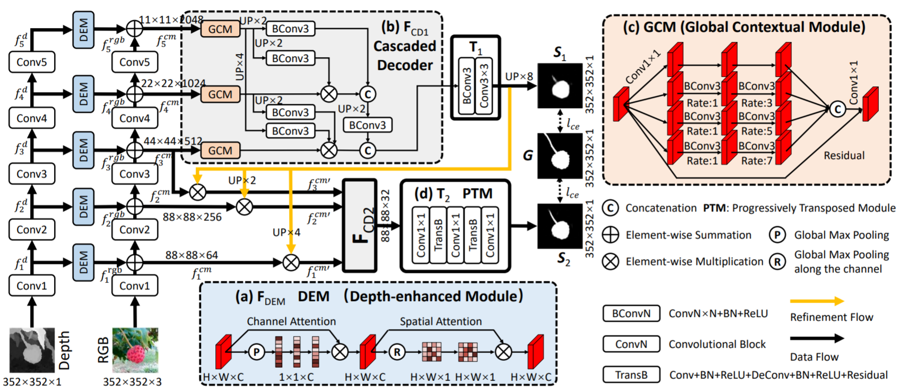
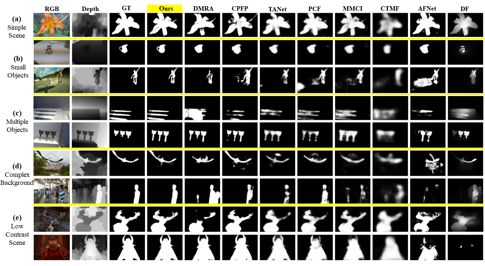
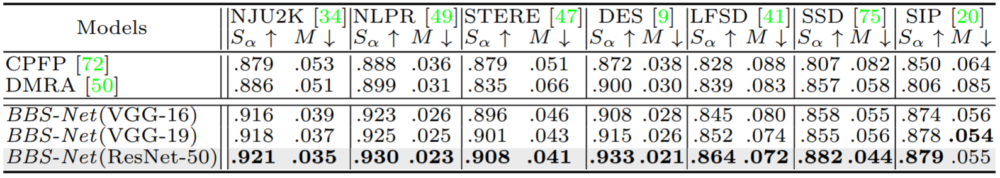

# BBS-Net
BBS-Net: RGB-D Salient Object Detection with
a Bifurcated Backbone Strategy Network

      
 <em> 
    Figure 1: Pipeline of the BBS-Net.
    </em>

## 1. Requirements

Python 3.7, Pytorch 0.4.0+, Cuda 10.0, TensorboardX 2.0, opencv-python

## 2. Data Preparation

 - Download the raw data from [Here](https://pan.baidu.com/s/1SxBjlTF4Tb74WjuDsRmM3w) [code: yiy1] and trained model (BBSNet.pth) from [Here](https://pan.baidu.com/s/1Fn-Hvdou4DDWcgeTtx081g) [code: dwcp]. Then put them under the following directory:
 
        -BBS_dataset\ 
          -RGBD_for_train\  
          -RGBD_for_test\
          -test_in_train\
        -BBSNet
          -models\
          -model_pths\
             -BBSNet.pth
          ...
          
 - Note that the depth maps of the raw data above are not normalized. If you train and test using the normalized depth maps, the performance will be improved.
	  
## 3. Training & Testing

- Train the BBSNet:

    `python BBSNet_train.py --batchsize 10 --gpu_id 0 `

- Test the BBSNet:

    `python BBSNet_test.py --gpu_id 0 `
    
    The test maps will be saved to './test_maps/'.

- Evaluate the result maps:
    
    You can evaluate the result maps using the tool in [here](http://dpfan.net/d3netbenchmark/).
    
- If you need the codes using VGG16 and VGG19 backbones, please send to the email (zhaiyingjier@163.com). Please provide your Name & Institution. Please note the code can be only used for research purpose.
## 4. Results
### 4.1 Qualitative Comparison

      
 <em> 
    Figure 2: Qualitative visual comparison of the proposed model versus 8 SOTA
models.
    </em>

      
 <em>
  Table 1: Quantitative comparison of models using S-measure max F-measure, max E-measureand MAE scores on 7 datasets. 
  </em>

<!--
|  Dataset  | NJU2K  | NLPR | STERE |DES    |LFSD  |SSD |SIP|
|  -------  | -----  |----  |-----  |---    |----  |---  |---|
| S-measure |.921    |.930  |.908   |.933  | .864  | .882|.879 |
| F-measure |.920    |.918  |.903   |.927  | .859  | .859|.883 |
| E-measure |.949    |.961  |.942   |.966  | .901  | .919|.922 |
| MAE       | .035   |.023  |.041   |.021  | .072  | .044|.055 |
-->

### 4.2 Results of multiple backbones

      
 <em>
  Table 2: Performance comparison using different backbones. 
  </em>

### 4.3 Download
 - Test maps of the above datasets (ResNet50 backbone) can be download from [here](https://pan.baidu.com/s/1O-AhThLWEDVgQiPhX3QVYw) [code: qgai ].
 - Test maps of vgg16 and vgg19 backbones of our model can be  download from [here](https://pan.baidu.com/s/1_hG3hC2Fpt1cbAWuPrHEPA) [code: zuds ].
 - Test maps of DUT-RGBD dataset (using the proposed training-test splits of [DMRA](https://openaccess.thecvf.com/content_ICCV_2019/papers/Piao_Depth-Induced_Multi-Scale_Recurrent_Attention_Network_for_Saliency_Detection_ICCV_2019_paper.pdf)) can be downloaded from [here](https://pan.baidu.com/s/15oc_-nwEKNiU1C9WRho5lg) [code: 3nme ].
## 5. Citation

Please cite the following paper if you use this repository in your reseach.

	@inproceedings{fan2020bbsnet,
	title={BBS-Net: RGB-D Salient Object Detection with a Bifurcated Backbone Strategy Network},
	author={Fan, Deng-Ping and Zhai, Yingjie and Borji, Ali and Yang, Jufeng and Shao, Ling},
	booktitle={ECCV},
	year={2020}
	}

- For more information about BBS-Net, please read the [Manuscript (PDF)](https://arxiv.org/pdf/2007.02713.pdf) ([Chinese version](https://pan.baidu.com/s/1zxni7QjBiewwA1Q-m7Cqfg)[code:0r4a]).

## 6. Benchmark RGB-D SOD

The complete RGB-D SOD benchmark can be found in this page:

http://dpfan.net/d3netbenchmark/

## 7. Acknowledgement
We implement this project based on the code of ‘Cascaded Partial Decoder for Fast and Accurate Salient Object Detection, CVPR2019’ proposed by Wu et al.
